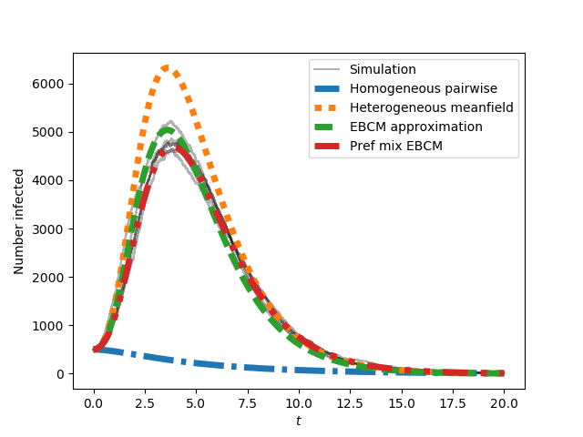
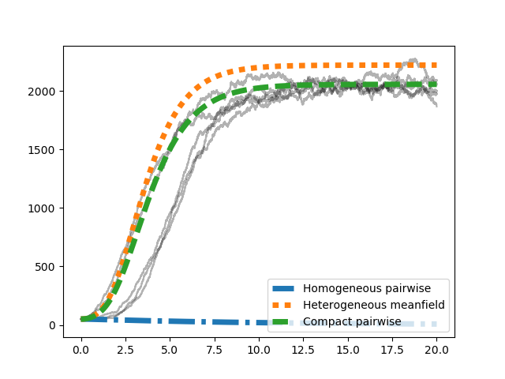

Getting Started
===============

Installation
------------
You can **install EoN version 1.2** with pip

::

    pip install EoN

If you have installed a previous version and want to reinstall with the most 
recent version available through pip (1.2).  The easiest way is 

::

    pip install EoN --upgrade

If you are using Anaconda, go to the Anaconda command line and use 
`pip install EoN`    

To **install EoN with a later (in development) version** You can clone or 
download the Github version at 
https://github.com/springer-math/Mathematics-of-Epidemics-on-Networks

Then just move into the main directory and run

:: 

    python setup.py install

EoN requires ``numpy``, ``scipy``, and ``matplotlib``.  If you don't have them
and you install through `pip`, these will automatically be added.  Some of the 
visualization tools provide support for animations, but producing the 
animations will require installation of something like ``ffmpeg``.

Current Version
---------------

The documentation provided here is for version 1.2.

If you want to see changes from previous versions, please see 
`Changes from v1.0 <Changes.html>`_.

Citing
------

If you use EoN, or publish anything based on it, please cite the
`Journal of Open Source Software publication <https://doi.org/10.21105/joss.01731>`_

Also, please
`let me know <https://github.com/springer-math/Mathematics-of-Epidemics-on-Networks/issues/31>`_ 
so that I can use it for performance reviews and grant applications and generally
because it makes me happy.

QuickStart Guide
----------------

The code here provides an example of creating a Barabasi-Albert network.  
Then it performs several simulations of an SIR epidemic starting with a fraction 
rho randomly infected initially.  Finally it uses several analytic models to 
predict the spread of an epidemic in a random network with the given properties.

::

    import networkx as nx
    import matplotlib.pyplot as plt
    import EoN
    
    N=10**5
    G=nx.barabasi_albert_graph(N, 5) #create a barabasi-albert graph
    
    tmax = 20
    iterations = 5  #run 5 simulations
    tau = 0.1           #transmission rate
    gamma = 1.0    #recovery rate
    rho = 0.005      #random fraction initially infected
    
    for counter in range(iterations): #run simulations
        t, S, I, R = EoN.fast_SIR(G, tau, gamma, rho=rho, tmax = tmax)
        if counter == 0:
            plt.plot(t, I, color = 'k', alpha=0.3, label='Simulation')
        plt.plot(t, I, color = 'k', alpha=0.3)
            
    #Now compare with ODE predictions.  Read in the degree distribution of G
    #and use rho to initialize the various model equations.
    #There are versions of these functions that allow you to specify the
    #initial conditions rather than starting from a graph.
    
    #we expect a homogeneous model to perform poorly because the degree
    #distribution is very heterogeneous
    t, S, I, R = EoN.SIR_homogeneous_pairwise_from_graph(G, tau, gamma, rho=rho, tmax = tmax)
    plt.plot(t, I, '-.', label = 'Homogeneous pairwise', linewidth = 5)
    
    #meanfield models will generally overestimate SIR growth because they
    #treat partnerships as constantly changing.
    t, S, I, R = EoN.SIR_heterogeneous_meanfield_from_graph(G, tau, gamma, rho=rho, tmax=tmax)
    plt.plot(t, I, ':', label = 'Heterogeneous meanfield', linewidth = 5)
    
    #The EBCM model does not account for degree correlations or clustering
    t, S, I, R = EoN.EBCM_from_graph(G, tau, gamma, rho=rho, tmax = tmax)
    plt.plot(t, I, '--', label = 'EBCM approximation', linewidth = 5)
    
    #the preferential mixing model captures degree correlations.
    t, S, I, R = EoN.EBCM_pref_mix_from_graph(G, tau, gamma, rho=rho, tmax=tmax)
    plt.plot(t, I, label = 'Pref mix EBCM', linewidth=5, dashes=[4, 2, 1, 2, 1, 2])

    plt.xlabel('$t$')
    plt.ylabel('Number infected')

    plt.legend()
    plt.savefig('SIR_BA_model_vs_sim.png')
    
This produces

The preferential mixing version of the EBCM approach provides the best approximation
to the (gray) simulated epidemics.  We now move on to SIS epidemics:

::

    plt.clf()
   
    #Now run for SIS.   Simulation is much slower so need smaller network
    N=10**4  
    G=nx.barabasi_albert_graph(N, 5) #create a barabasi-albert graph
    for counter in range(iterations):
        t, S, I = EoN.fast_SIS(G, tau, gamma, rho=rho, tmax = tmax)
        if counter == 0:
            plt.plot(t, I, color = 'k', alpha=0.3, label='Simulation')
        plt.plot(t, I, color = 'k', alpha=0.3)
            
    #Now compare with ODE predictions.  Read in the degree distribution of G
    #and use rho to initialize the various model equations.
    #There are versions of these functions that allow you to specify the
    #initial conditions rather than starting from a graph.
    
    #we expect a homogeneous model to perform poorly because the degree
    #distribution is very heterogeneous
    t, S, I = EoN.SIS_homogeneous_pairwise_from_graph(G, tau, gamma, rho=rho, tmax = tmax)
    plt.plot(t, I, '-.', label = 'Homogeneous pairwise', linewidth = 5)
    
    t, S, I = EoN.SIS_heterogeneous_meanfield_from_graph(G, tau, gamma, rho=rho, tmax=tmax)
    plt.plot(t, I, ':', label = 'Heterogeneous meanfield', linewidth = 5)
    
    t, S, I = EoN.SIS_compact_pairwise_from_graph(G, tau, gamma, rho=rho, tmax=tmax)
    plt.plot(t, I, '--', label = 'Compact pairwise', linewidth = 5)

    plt.xlabel('$t$')
    plt.ylabel('Number infected')
    plt.legend()
    plt.savefig('SIS_BA_model_vs_sim.png')

This produces

