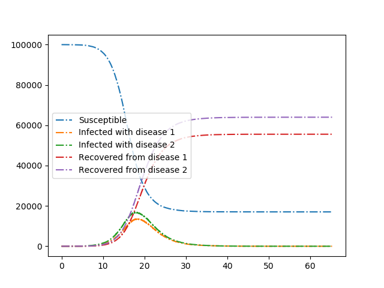
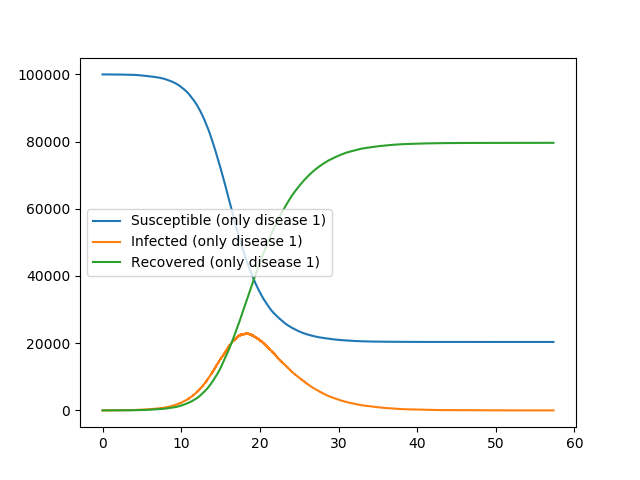

Competing Diseases
------------------

:download:`Downloadable Source Code <arbitrary_dynamics/Compete.py>` 

We consider two diseases that compete in the sense that if an individual has
recovered from one disease, then if it is infected with the other disease it
transmits with lower rate and it recovers faster.

Because our initial condition is quite small, the final outcome is somewhat 
stochastic, even though the curves look quite smooth.  The stochasticity is 
manifested when the populations are still small.

Our first plot shows the two diseases competing.  The second plot shows
what happens if there is just one disease present.

::

    r'''We consider two diseases that compete in the sense that if an individual has
    recovered from one disease, then if it is infected with the other disease it
    transmits with lower rate and it recovers faster.'''
    import EoN
    import networkx as nx
    from collections import defaultdict
    import matplotlib.pyplot as plt
    
    N = 100000
    G = nx.fast_gnp_random_graph(N, 5./(N-1))
    
    H = nx.DiGraph()  #DiGraph showing possible transitions that don't require an interaction
    H.add_node('SS')
    H.add_edge('SI', 'SR', rate = 0.3)
    H.add_edge('IS', 'RS', rate = 0.3)
    H.add_edge('II', 'IR', rate = 0.3)
    H.add_edge('II', 'RI', rate = 0.3)
    H.add_edge('IR', 'RR', rate = 1)
    H.add_edge('RI', 'RR', rate = 1)
    
    J = nx.DiGraph()    #DiGraph showing transitions that do require an interaction.
    J.add_edge(('SI', 'SS'), ('SI', 'SI'), rate = 0.2)
    J.add_edge(('SI', 'IS'), ('SI', 'II'), rate = 0.2)
    J.add_edge(('SI', 'RS'), ('SI', 'RI'), rate = 0.2)
    J.add_edge(('II', 'SS'), ('II', 'SI'), rate = 0.2)
    J.add_edge(('II', 'IS'), ('II', 'II'), rate = 0.2)
    J.add_edge(('II', 'RS'), ('II', 'RI'), rate = 0.2)
    J.add_edge(('RI', 'SS'), ('RI', 'SI'), rate = 0.1)
    J.add_edge(('RI', 'IS'), ('RI', 'II'), rate = 0.1)
    J.add_edge(('RI', 'RS'), ('RI', 'RI'), rate = 0.1)
    J.add_edge(('IS', 'SS'), ('IS', 'IS'), rate = 0.2)
    J.add_edge(('IS', 'SI'), ('IS', 'II'), rate = 0.2)
    J.add_edge(('IS', 'SR'), ('IS', 'IR'), rate = 0.2)
    J.add_edge(('II', 'SS'), ('II', 'IS'), rate = 0.2)
    J.add_edge(('II', 'SI'), ('II', 'II'), rate = 0.2)
    J.add_edge(('II', 'SR'), ('II', 'IR'), rate = 0.2)
    J.add_edge(('IR', 'SS'), ('IR', 'IS'), rate = 0.1)
    J.add_edge(('IR', 'SI'), ('IR', 'II'), rate = 0.1)
    J.add_edge(('IR', 'SR'), ('IR', 'IR'), rate = 0.1)
    
    IC = defaultdict(lambda: 'SS')
    for node in range(5):
        IC[node] = 'II'
    
    return_statuses = ('SS', 'SI', 'SR', 'IS', 'II', 'IR', 'RS', 'RI', 'RR')
    
    t, SS, SI, SR, IS, II, IR, RS, RI, RR = EoN.Gillespie_simple_contagion(G, H, J, IC, return_statuses,
                                            tmax = float('Inf'))
    
    plt.plot(t, SS, '-.', label = 'Susceptible')
    plt.plot(t, IS+II+IR, '-.', label = 'Infected with disease 1')
    plt.plot(t, SI+II+RI, '-.', label = 'Infected with disease 2')
    plt.plot(t, RS+IR+RR, '-.', label = 'Recovered from disease 1')
    plt.plot(t, SR+RI+RR, '-.', label = 'Recovered from disease 2')
    plt.legend(loc = 'center left')
    plt.savefig('Compete_both.png')
    
    IC = defaultdict(lambda: 'SS')
    for node in range(5):
        IC[node] = 'IS'
    t, SS, SI, SR, IS, II, IR, RS, RI, RR = EoN.Gillespie_simple_contagion(G, H, J, IC, return_statuses,
                                            tmax = float('Inf'))
    
    plt.clf()
    plt.plot(t, SS, '-', label = 'Susceptible (only disease 1)')
    plt.plot(t, IS+II+IR, '-', label = 'Infected (only disease 1)')
    plt.plot(t, RS+IR+RR, '-', label = 'Recovered (only disease 1)')
    plt.legend(loc = 'center left')
    plt.savefig('Compete_just1disease.png')
    
