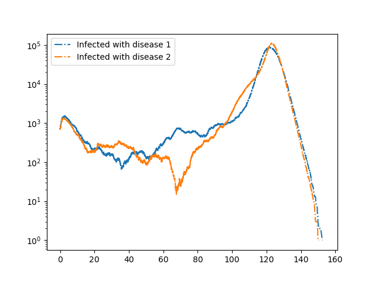

Cooperative diseases
--------------------

:download:`Downloadable Source Code <arbitrary_dynamics/Cooperate.py>` 

Note that the dynamics of this case are sensitive to noise, so rerunning this
code will not yield an exact match to this figure.

We consider two diseases that cooperate in the sense that if an individual has
recovered from one disease, then if it is infected with the other disease it
transmits with higher rate and it remains infectious longer.  This is a bit
unrealistic, but could correspond to an individual having a more mild infection
resulting in the individual remaining active in the population rather than
self-isolating at home.

::

    import EoN
    import networkx as nx
    from collections import defaultdict
    import matplotlib.pyplot as plt
    
    N = 2000000
    G = nx.fast_gnp_random_graph(N, 5./(N-1))
    
    #In the below:
    #'SS' means a node susceptible to both diseases
    #'SI' means susceptible to disease 1 and infected with disease 2
    #'RS' means recovered from disease 1 and susceptible to disease 2.
    #etc.
    
    H = nx.DiGraph()  #DiGraph showing possible transitions that don't require an interaction
    H.add_node('SS')  
    H.add_edge('SI', 'SR', rate = 1)
    H.add_edge('IS', 'RS', rate = 1)
    H.add_edge('II', 'IR', rate = 1)
    H.add_edge('II', 'RI', rate = 1)
    H.add_edge('IR', 'RR', rate = 0.5)
    H.add_edge('RI', 'RR', rate = 0.5)
    
    #In the below the edge (('SI', 'SS'), ('SI', 'SI')) means an
    #'SI' node connected to an 'SS' node can lead to a transition in which
    #the 'SS' node becomes 'SI'.  The rate of this transition is 0.2.
    #
    #Note that `IR` and `RI` nodes are more infectious than other nodes.
    #
    J = nx.DiGraph()    #DiGraph showing transitiona that do require an interaction.
    J.add_edge(('SI', 'SS'), ('SI', 'SI'), rate = 0.2)
    J.add_edge(('SI', 'IS'), ('SI', 'II'), rate = 0.2)
    J.add_edge(('SI', 'RS'), ('SI', 'RI'), rate = 0.2)
    J.add_edge(('II', 'SS'), ('II', 'SI'), rate = 0.2)
    J.add_edge(('II', 'IS'), ('II', 'II'), rate = 0.2)
    J.add_edge(('II', 'RS'), ('II', 'RI'), rate = 0.2)
    J.add_edge(('RI', 'SS'), ('RI', 'SI'), rate = 1)
    J.add_edge(('RI', 'IS'), ('RI', 'II'), rate = 1)
    J.add_edge(('RI', 'RS'), ('RI', 'RI'), rate = 1)
    J.add_edge(('IS', 'SS'), ('IS', 'IS'), rate = 0.2)
    J.add_edge(('IS', 'SI'), ('IS', 'II'), rate = 0.2)
    J.add_edge(('IS', 'SR'), ('IS', 'IR'), rate = 0.2)
    J.add_edge(('II', 'SS'), ('II', 'IS'), rate = 0.2)
    J.add_edge(('II', 'SI'), ('II', 'II'), rate = 0.2)
    J.add_edge(('II', 'SR'), ('II', 'IR'), rate = 0.2)
    J.add_edge(('IR', 'SS'), ('IR', 'IS'), rate = 1)
    J.add_edge(('IR', 'SI'), ('IR', 'II'), rate = 1)
    J.add_edge(('IR', 'SR'), ('IR', 'IR'), rate = 1)
    
    
    return_statuses = ('SS', 'SI', 'SR', 'IS', 'II', 'IR', 'RS', 'RI', 'RR')
    
    initial_size = 700
    IC = defaultdict(lambda: 'SS')
    for node in range(initial_size):
        IC[node] = 'II'
    
    
    t, SS, SI, SR, IS, II, IR, RS, RI, RR = EoN.Gillespie_simple_contagion(G, H, J, IC, return_statuses, 
                                            tmax = float('Inf'))    
    
    plt.semilogy(t, IS+II+IR, '-.', label = 'Infected with disease 1')
    plt.semilogy(t, SI+II+RI, '-.', label = 'Infected with disease 2') 
    
    plt.legend()
    plt.savefig('Cooperate.png')