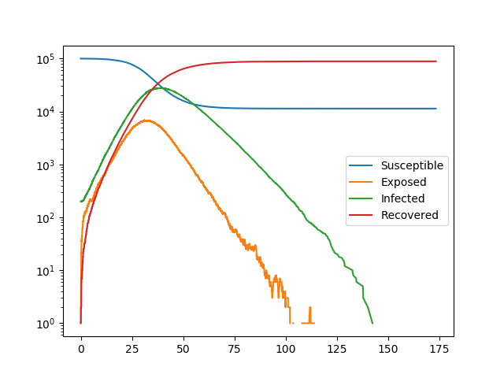

SEIR
----

:download:`Downloadable Source Code <arbitrary_dynamics/SEIR.py>` 

This has a variable transmission rate across different edges and a variable
rate of transitioning from exposed to infected across different nodes.

These heterogeneities are introduced by assigning attributes to the individuals
and partnerships in the contact network.  The transition rates are simply
multiplied by those attributes.  More complex methods are provided in :ref:`heterogeneous_SIRS_example`
which allow us to scale the transitions by some function of the nodes [this may
be particularly useful when disease is more infectious in one direction, as in
many sexually transmitted diseases].

::

    import EoN
    import networkx as nx
    from collections import defaultdict
    import matplotlib.pyplot as plt
    import random
    
    N = 100000
    G = nx.fast_gnp_random_graph(N, 5./(N-1))
    
    #they will vary in the rate of leaving exposed class.
    #and edges will vary in transition rate.
    #there is no variation in recovery rate.
    
    node_attribute_dict = {node: 0.5+random.random() for node in G.nodes()}
    edge_attribute_dict = {edge: 0.5+random.random() for edge in G.edges()}
    
    nx.set_node_attributes(G, values=node_attribute_dict, name='expose2infect_weight')
    nx.set_edge_attributes(G, values=edge_attribute_dict, name='transmission_weight')
    #These individual and partnership attributes will be used to scale
    #the transition rates.  When we define `H` and `J`, we provide the name
    #of these attributes.
    
    
    #We show how node and edge attributes in the contact network 'G' can be used
    #to scale the transmission rates.  More advanced techniques are shown in
    #other examples.
    
    H = nx.DiGraph()
    H.add_node('S') #This line is actually unnecessary since 'S' does not change status intrinsically
    #
    H.add_edge('E', 'I', rate = 0.6, weight_label='expose2infect_weight')
    #  The line above states that the transition from 'E' to 'I' occurs with rate
    #  0.6  times  whatever value is in the individual's attribute 'expose2infect_weight'
    #
    H.add_edge('I', 'R', rate = 0.1)
    #  The line above states that the I to 'R' transition occurs with rate 0.1
    #  and does not depend on any attribute
    
    J = nx.DiGraph()
    J.add_edge(('I', 'S'), ('I', 'E'), rate = 0.1, weight_label='transmission_weight')
    #  The line above states that an 'I' individual will cause an 'S' individual
    #  to transition to 'E' with rate equal to 0.1 times the partnership's attribute
    #  'transmission_weight'.
    
    
    IC = defaultdict(lambda: 'S')
    for node in range(200):
        IC[node] = 'I'
    
    return_statuses = ('S', 'E', 'I', 'R')
    
    t, S, E, I, R = EoN.Gillespie_simple_contagion(G, H, J, IC, return_statuses,
                                            tmax = float('Inf'))
    
    plt.semilogy(t, S, label = 'Susceptible')
    plt.semilogy(t, E, label = 'Exposed')
    plt.semilogy(t, I, label = 'Infected')
    plt.semilogy(t, R, label = 'Recovered')
    plt.legend()
    
    plt.savefig('SEIR.png')