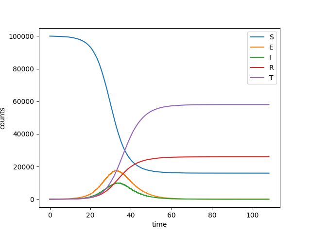

SEIRT
-----

:download:`Downloadable Source Code <arbitrary_dynamics/SEIRT.py>` 

We consider an SEIR style model, but with contact tracing of identified contacts.
An infected person may be identified, in which case his/her contacts are traced with
some rate.

We consider a simple model, a separate example shows an SEIR model<SEIR.rst> with
weighted edges.
::

    import EoN
    import networkx as nx
    from collections import defaultdict
    import matplotlib.pyplot as plt
    import random
    
    N = 100000
    G = nx.fast_gnp_random_graph(N, 5./(N-1))
    
    
    #we must define two graphs, one of which has the internal transitions
    H = nx.DiGraph()
    H.add_node('S')  #This line is unnecessary.
    H.add_edge('E', 'I', rate = 1./4)
    H.add_edge('I', 'R', rate = 1./7)
    H.add_edge('I', 'T', rate = 1./10)
    
    #and the other graph has transitions caused by a neighbor.
    J = nx.DiGraph()
    J.add_edge(('I', 'S'), ('I', 'E'), rate = 2.5/7)
    J.add_edge(('T', 'I'), ('T', 'T'), rate = 0.2)
    IC = defaultdict(lambda: 'S')
    for node in range(20):
        IC[node] = 'I'
    
    return_statuses = ('S', 'E', 'I', 'R', 'T')
    
    t, S, E, I, R, T = EoN.Gillespie_simple_contagion(G, H, J, IC, return_statuses,
                                            tmax = float('Inf'))
    
    plt.plot(t, S, label = 'S')
    plt.plot(t, E, label = 'E')
    plt.plot(t, I, label = 'I')
    plt.plot(t, R, label = 'R')
    plt.plot(t, T, label = 'T')
    plt.clf()plt.legend()
    plt.xlabel('time')
    plt.ylabel('counts')
    plt.savefig('SEIRT.png')
    plt.show()