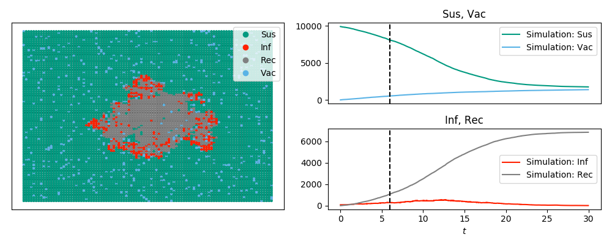

SIRV display and animation example
----------------------------------

:download:`Downloadable Source Code <SIRV_display.py>` 

The code below looks at an SIRV epidemic (SIR + vaccination) and produces the image

    
and the animation

.. raw:: html 

   <video controls src="../_static/SIRV_animate.mp4", width = 90%></video> 

Note that the labels are in plain text rather than math mode (since ``tex=False``).
Note also that we can plot ``'Sus'+'Vac'`` and similar time series using the
commands here.

If we use a model with other states than ``'S'``, ``'I'``, and ``'R'``, the default 
colors aren't specified.  In this case we need to do a little bit more.

Consider a model where the states are ``'Sus'``, ``'Inf'``, ``'Rec'``, or ``'Vac'``.  
That is, an SIR model with vaccination.  We will use ``Gillespie_simple_contagion``
for this.  I'm choosing the status names to be longer than one character to 
show changes in the argument ``ts_plots`` stating what the time-series plots 
should show.

In this model, susceptible people have a rate of becoming vaccinated which is
independent of the disease status.  Otherwise, it is just like the SIR disease
in the previous example.  So the "spontaneous transitions" are ``'Suc'`` to 
``'Vac'`` with rate ``0.01`` and ``'Inf'`` to ``'Rec'`` with rate ``1.0``.  
The "induced transitions" are ``('Inf', 'Sus')`` to ``('Inf', 'Inf')`` with 
rate ``2.0``.

::

    import networkx as nx
    import EoN
    import matplotlib.pyplot as plt
    from collections import defaultdict
    G = nx.grid_2d_graph(100,100) #each node is (u,v) where 0<=u,v<=99
    #we'll initially infect those near the middle 
    initial_infections = [(u,v) for (u,v) in G if 45<u<55 and 45<v<55]

    H = nx.DiGraph()  #the spontaneous transitions
    H.add_edge('Sus', 'Vac', rate = 0.01)
    H.add_edge('Inf', 'Rec', rate = 1.0)
    
    J = nx.DiGraph()  #the induced transitions
    J.add_edge(('Inf', 'Sus'), ('Inf', 'Inf'), rate = 2.0)
    
    IC = defaultdict(lambda:'Sus')
    for node in initial_infections:
        IC[node] = 'Inf'
        
    return_statuses = ['Sus', 'Inf', 'Rec', 'Vac']
    
    colordict = {'Sus': '#009a80','Inf':'#ff2000', 'Rec':'gray','Vac': '#5AB3E6'}
    pos = {node:node for node in G}
    tex = False
    sim_kwargs = {'colordict':colordict, 'pos':pos, 'tex':tex}

    sim = EoN.Gillespie_simple_contagion(G, H, J, IC, return_statuses, tmax=30, return_full_data=True, sim_kwargs=sim_kwargs)

    ts, D = sim.summary()
    newD = {'Sus+Vac':D['Sus']+D['Vac'], 'Inf+Rec' : D['Inf'] + D['Rec']}
    new_timeseries = (ts, newD) 
    sim.add_timeseries(new_timeseries, label = 'Simulation', colordict={'Sus+Vac':'#E69A00', 'Inf+Rec':'#CD9AB3'})

    sim.display(6, node_size = 4, ts_plots=[['Inf'], ['Sus+Vac', 'Inf+Rec']])
    plt.savefig('SIRV_display.png')

    ani=sim.animate(ts_plots=[['Inf'], ['Sus+Vac', 'Inf+Rec']], node_size = 4)  
    ani.save('SIRV_animate.mp4', fps=5, extra_args=['-vcodec', 'libx264'])
    
