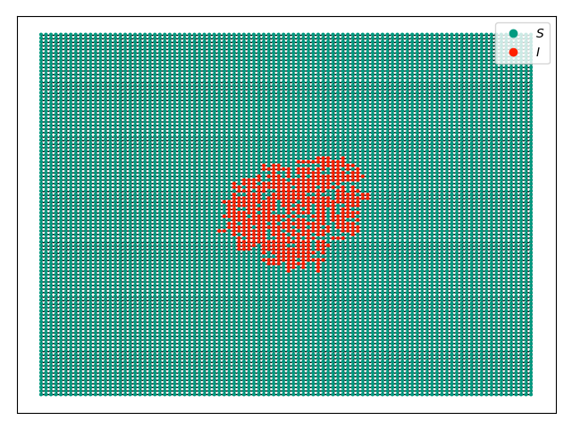

SIS display example
-------------------

:download:`Downloadable Source Code <SIS_display.py>` 

The code below produces a snapshot of an SIS epidemic with the timeseries:

.. image:: SIS_2dgrid.png
    :width: 90 %

and without the timeseries:

We start with an SIS epidemic in a 100x100 grid with a few nodes infected in 
the middle.  We will display the epidemic at time 6, with and without the
time series included.

::

    import networkx as nx
    import EoN
    import matplotlib.pyplot as plt
    G = nx.grid_2d_graph(100,100) #each node is (u,v) where 0<=u,v<=99
    #we'll initially infect those near the middle 
    initial_infections = [(u,v) for (u,v) in G if 45<u<55 and 45<v<55]
    sim = EoN.fast_SIS(G, 1.0, 1.0, initial_infecteds = initial_infections, 
                   return_full_data=True, tmax = 40)
    pos = {node:node for node in G}
    sim.set_pos(pos)
    sim.display(6, node_size = 4) #display time 6
    plt.savefig('SIS_2dgrid.png')

If we changed the ``display`` command to have ``ts_plots=False`` or 
``ts_plots = []`` we get just the network.

::

    plt.clf()
    sim.display(6, node_size = 4, ts_plots=[]) #display time 6
    plt.savefig('SIS_2dgrid_no_time_series.png')
    
Animations are shown in the next example.

