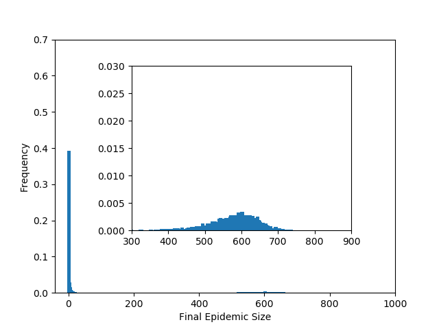

Figure 1.5
-----------

:download:`Downloadable Source Code <fig1p5.py>` 

::

    import EoN
    import networkx as nx
    import matplotlib.pyplot as plt
    
    from collections import defaultdict
    
    
    N=1000
    gamma = 1
    tau = 1.5/N
    G = nx.complete_graph(N)
    iterations = 10000
    binwidth = 10
    
    H = defaultdict(int)
    for counter in range(iterations):
        t, S, I, R = EoN.fast_SIR(G, tau, gamma)
        H[binwidth*(R[-1]/binwidth)] = H[binwidth*(R[-1]/binwidth)]+1./iterations
    
    
    fig = plt.figure(1)
    main = plt.axes()
    
    main.bar(*zip(*H.items()), width = binwidth, linewidth=0)
    main.axis(xmax=1000, ymax = 0.7)
    plt.xlabel('Final Epidemic Size')
    plt.ylabel('Frequency')
    
    inset = plt.axes([0.3,0.3,0.5,0.5])
    inset.bar(*zip(*H.items()), width = binwidth, linewidth=0)
    inset.axis(xmin = 300, xmax = 900, yin=0, ymax = 0.03)
    
    plt.savefig('fig1p5.png')