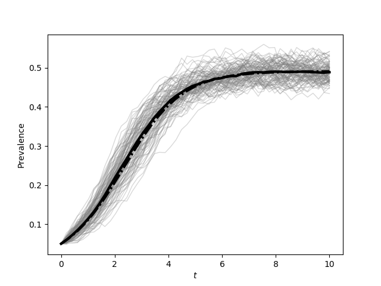
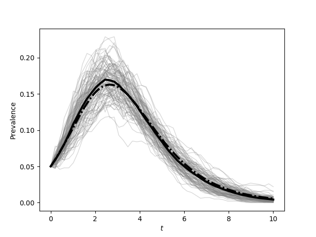

Figure 4.1 (a and b)
--------------------------

:download:`Downloadable Source Code <fig4p1.py>` 

::

    import EoN
    import networkx as nx
    import matplotlib.pyplot as plt
    import scipy
    import random
    
    N = 1000
    kave = 30.
    gamma = 1.
    tau = 1./15
    tmax = 10
    
    rho = 0.05
    iterations = 100
    
    tcount = 50
    
    report_times = scipy.linspace(0,tmax,tcount)
    
    SIS_Isum=scipy.zeros(tcount)
    SIR_Isum=scipy.zeros(tcount)
    
    for counter in range(iterations):
        #do SIS simulation and then SIR simulation.
        G = nx.fast_gnp_random_graph(N, kave/(N-1))
        initial_infecteds = random.sample(G.nodes(), int(rho*G.order()))
        
        t, S, I = EoN.fast_SIS(G, tau, gamma, initial_infecteds=initial_infecteds, tmax=tmax)
        I = EoN.subsample(report_times, t, I)
        SIS_Isum += I
        plt.figure(0)
        plt.plot(report_times, I*1./N, linewidth=1, alpha=0.3, color='grey')
        t, S, I, R = EoN.fast_SIR(G, tau, gamma, initial_infecteds=initial_infecteds, tmax=tmax)
        I = EoN.subsample(report_times, t, I)
        SIR_Isum += I
        plt.figure(1)
        plt.plot(report_times, I*1./N, linewidth=1, alpha=0.3, color='grey')
    
    S0 = (1-rho)*N
    I0 = rho*N
    SI0 = (1-rho)*N*kave*rho
    SS0 = (1-rho)*N*kave*(1-rho)
    t, S, I = EoN.SIS_homogeneous_pairwise(S0, I0, SI0, SS0, kave, tau, 
                                            gamma, tmax=tmax)
    plt.figure(0)
    plt.plot(report_times,SIS_Isum/(N*iterations), color='k', linewidth=3)
    plt.plot(t, I/N, '-.', color='k', linewidth=3)
    plt.xlabel('$t$')
    plt.ylabel('Prevalence')
    plt.savefig('fig4p1a.png')
    
    
    t, S, I, R = EoN.SIR_homogeneous_pairwise(S0, I0, 0, SI0, SS0, kave, tau, 
                                            gamma, tmax=tmax)
    plt.figure(1)
    plt.plot(report_times,SIR_Isum/(N*iterations), color='k', linewidth=3)
    plt.plot(t, I/N, '-.', color='k', linewidth=3)
    plt.xlabel('$t$')
    plt.ylabel('Prevalence')
    plt.savefig('fig4p1b.png')
    
