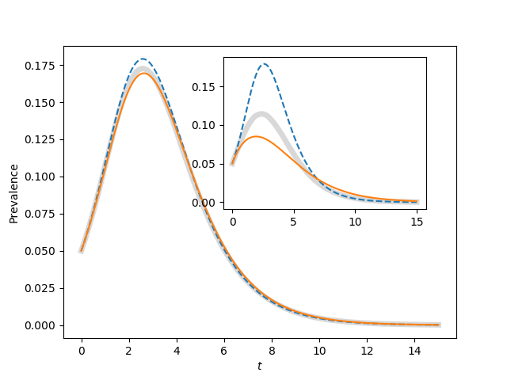

Figure 4.13
-----------

:download:`Downloadable Source Code <fig4p13.py>` 

::

        
    
    import EoN
    import networkx as nx
    import matplotlib.pyplot as plt
    import scipy
    
    r'''
    Reproduces figure 4.13
    
    With N=1000, there is still significant stochasticity.  Some epidemics have earlier
    peaks than others.  When many of these are averaged together, the final outcome
    is that the average has a lower, broader peak than a typical epidemic.  In
    this case it tends to make the Erdos-Renyi network for <K>=50 look like a better
    fit for the homogeneous_pairwise model.
    
    Increasing N to 10000 will eliminate this.
    '''
    
    print("Often stochastic effects cause the peak for <K>=50 to be lower than predicted.")
    print("See comments in code for explanation")
    
    
    
    N=10000
    gamma = 1.
    iterations = 200
    rho = 0.05
    tmax = 15
    tcount = 1001
    
    report_times = scipy.linspace(0,tmax,tcount)
    ax1 = plt.gca()#axes([0.1,0.1,0.9,0.9])
    ax2 = plt.axes([0.44,0.45,0.4,0.4])
    
    for kave, ax in zip((50, 5), (ax1, ax2)):
        tau = 2*gamma/kave
        Isum = scipy.zeros(tcount)
        
        for counter in range(iterations):
            G = nx.fast_gnp_random_graph(N,kave/(N-1.))
            t, S, I, R = EoN.fast_SIR(G, tau, gamma, tmax=tmax, rho=rho)
            I = I*1./N
            I = EoN.subsample(report_times, t, I)
            Isum += I
        ax.plot(report_times, Isum/iterations, color='grey', linewidth=5, alpha=0.3)
            
        S0 = (1-rho)*N
        I0 = rho*N
        R0=0
        
        t, S, I, R = EoN.SIR_homogeneous_meanfield(S0, I0, R0, kave, tau, gamma, 
                                                tmax=tmax, tcount=tcount)
        ax.plot(t, I/N, '--')
    
        SI0 = (1-rho)*N*kave*rho
        SS0 = (1-rho)*N*kave*(1-rho)
        t, S, I, R = EoN.SIR_homogeneous_pairwise(S0, I0, R0, SI0, SS0, kave, tau, gamma, 
                                    tmax=tmax, tcount=tcount)
        ax.plot(t, I/N)
        
            
    ax1.set_xlabel('$t$')
    ax1.set_ylabel('Prevalence')
    plt.savefig('fig4p13.png')