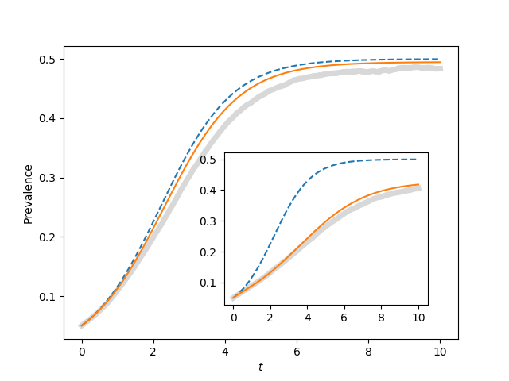

Figure 4.8
----------

:download:`Downloadable Source Code <fig4p8.py>` 

::

    import EoN
    import networkx as nx
    import matplotlib.pyplot as plt
    import scipy
    
    
    N=1000
    gamma = 1.
    iterations = 200
    rho = 0.05
    tmax = 10
    tcount = 1001
    
    report_times = scipy.linspace(0,tmax,tcount)
    
    #plt.plot([],[])
    ax1 = plt.gca()#axes([0.1,0.1,0.9,0.9])
    ax2 = plt.axes([0.44,0.2,0.4,0.4])
    for kave, ax in zip([50, 5], [ax1, ax2]):
        tau = 2*gamma/kave
        Isum = scipy.zeros(tcount)
    
        for counter in range(iterations):
            G = nx.configuration_model(N*[kave])
            t, S, I = EoN.fast_SIS(G, tau, gamma, tmax=tmax, rho=rho)
            I = I*1./N
            I = EoN.subsample(report_times, t, I)
            Isum += I
        ax.plot(report_times, Isum/iterations, color='grey', linewidth=5, alpha=0.3)
        
        S0 = (1-rho)*N
        I0 = rho*N
        
        t, S, I = EoN.SIS_homogeneous_meanfield(S0, I0, kave, tau, gamma, tmin=0, tmax=tmax, 
                                    tcount=tcount)
        ax.plot(t, I/N, '--')
        S0 = (1-rho)*N
        I0 = rho*N
        SI0 = (1-rho)*N*kave*rho
        SS0 = (1-rho)*N*kave*(1-rho)
        t, S, I = EoN.SIS_homogeneous_pairwise(S0, I0, SI0, SS0, kave, tau, gamma, tmin = 0, 
                                    tmax=tmax, tcount=tcount)
        ax.plot(t, I/N)
    
    ax1.xlabel('$t$')
    ax1.ylabel('Prevalence')
    plt.savefig('fig4p8.png')