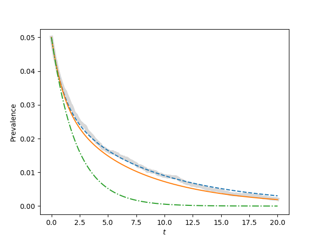
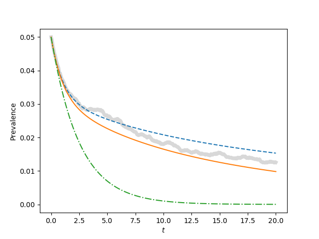
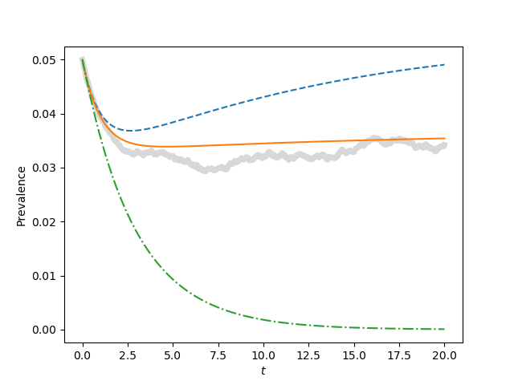
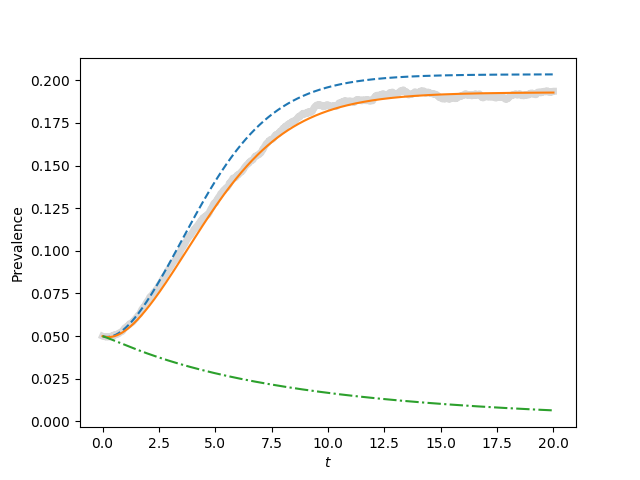

Figure 5.2 (a, b, c, and d)
---------------------------

   - Note that the book has a typo.  As with fig 4.7, for (c), $\\tau = 1.1\\tau_c$. 
   - It's worth looking at $1.2\\tau_c$ as well.  It's interesting.

:download:`Downloadable Source Code <fig5p2.py>` 

::

    import EoN
    import networkx as nx
    import matplotlib.pyplot as plt
    import scipy
    
    
    
    N=100000  #100 times as large as the value given in the text
    gamma = 1.
    iterations = 1
    rho = 0.05
    tmax = 20
    tcount = 1001
    kave = 20.
    ksqave = (5**2 + 35**2)/2.
    
    tau_c = gamma*kave/ksqave
    
    ksmall = 5
    kbig = 35
    deg_dist = [ksmall, kbig]*int(N/2)
    
    report_times = scipy.linspace(0, tmax, tcount)
    
    for tau, label in zip([0.9*tau_c, tau_c, 1.1*tau_c, 1.5*tau_c],['a', 'b', 'c', 'd']):
        print(str(tau_c)+" "+str(tau))
        plt.clf()
        
        Isum = scipy.zeros(tcount)
        for counter in range(iterations):
            G = nx.configuration_model(deg_dist)
            t, S, I = EoN.fast_SIS(G, tau, gamma, tmax=tmax, rho=rho)
            I = I*1./N
            I = EoN.subsample(report_times, t, I)
            Isum += I
        plt.plot(report_times, Isum/iterations, color='grey', linewidth=5, alpha=0.3)
    
        degree_array = scipy.zeros(kbig+1)
        degree_array[kbig]=N/2
        degree_array[ksmall]=N/2
        Sk0 = degree_array*(1-rho)
        Ik0 = degree_array*rho
                
        t, S, I = EoN.SIS_heterogeneous_meanfield(Sk0, Ik0, tau, gamma, tmax=tmax,
                                                    tcount=tcount)
        plt.plot(t, I/N, '--')
        
        
        SI0 = ((kbig + ksmall)*N/2.)*(1-rho)*rho
        SS0 = ((kbig+ksmall)*N/2.)*(1-rho)*(1-rho)
        II0 = ((kbig+ksmall)*N/2.)*rho*rho
        
        t, S, I = EoN.SIS_compact_pairwise(Sk0, Ik0, SI0, SS0, II0, tau, gamma, 
                                    tmax=tmax, tcount=tcount)
        plt.plot(t, I/N)
        #t, S, I = EoN.SIS_compact_pairwise(Sk0, I0, SI0, SS0, II0, tau, gamma, tmax=tmax, tcount=tcount)
        #plt.plot(t, I/N)
        
        I0 = N*rho
        S0 = N*(1-rho)
        kave = (kbig+ksmall)/2.
        
        t, S, I = EoN.SIS_homogeneous_pairwise(S0, I0, SI0, SS0, kave, tau, gamma, tmax=tmax, tcount=tcount)
        plt.plot(t, I/N, '-.')
        plt.xlabel('$t$')
        plt.ylabel('Prevalence')
        plt.savefig('fig5p2{}.png'.format(label))