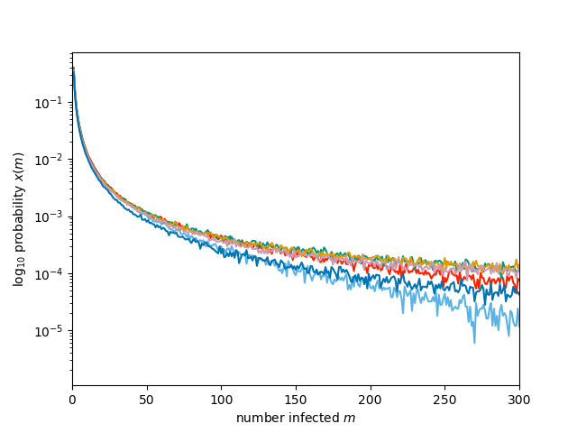
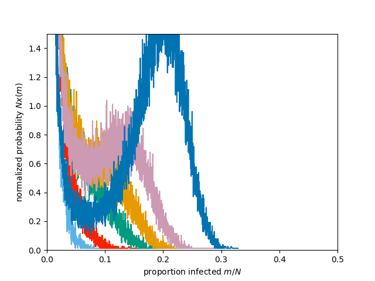

Figure 6.2 (a and b)
----------------------------------------------------

:download:`Downloadable Source Code <fig6p2.py>` 

::

    import networkx as nx
    import EoN
    from collections import defaultdict
    import matplotlib.pyplot as plt
    import scipy 
    
    colors = ['#5AB3E6','#FF2000','#009A80','#E69A00', '#CD9AB3', '#0073B3','#F0E442']
    
    iterations = 5*10**5
    
    
    
    N=6400
    kave = 5
    G = nx.fast_gnp_random_graph(N, kave/(N-1.))
    
    for index, p in enumerate([0.18, 0.19, 0.2, 0.205, 0.21, 0.22]):
        print(p)
        xm = defaultdict(int)
        for counter in range(iterations):
            t, S, I, R = EoN.basic_discrete_SIR_epidemic(G, p)
            xm[R[-1]] += 1./iterations
        items = sorted(xm.items())
        m, freq = zip(*items)
    
        
        plt.figure(1)
        plt.plot(m, freq, color=colors[index])
        plt.yscale('log')
        
        freq = scipy.array(freq)
        m= scipy.array(m)
        plt.figure(2)
        plt.plot()
        plt.plot(m/N, N*freq, color = colors[index])
    
    plt.figure(1)
    plt.axis(xmin=0, xmax=300)
    plt.xlabel('number infected $m$')
    plt.ylabel(r'$\log_{10}$ probability $x(m)$')
    plt.savefig('fig6p2a.png')
    
    plt.figure(2)
    plt.axis(xmin=0,xmax=0.5, ymax = 1.5, ymin=0)
    plt.xlabel('proportion infected $m/N$')
    plt.ylabel(r'normalized probability $Nx(m)$')
    plt.savefig('fig6p2b.png')