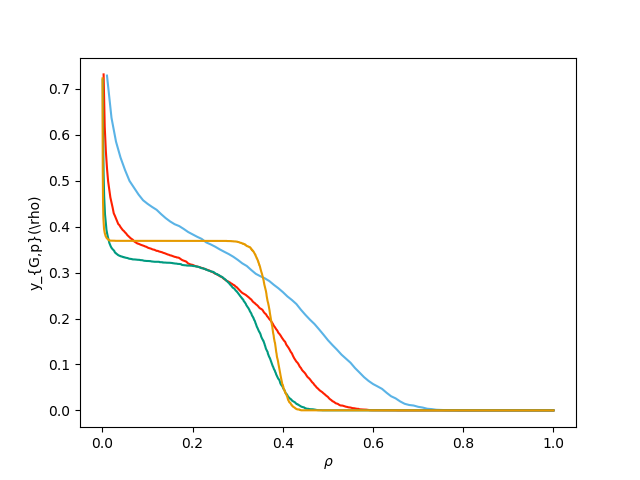
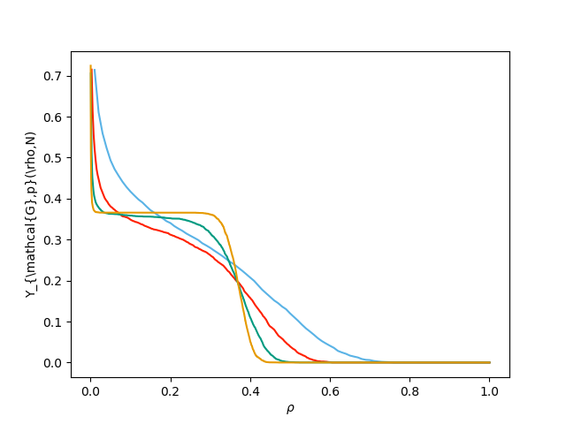

Figure 6.4 (a and b)
----------------------------------------------------

:download:`Downloadable Source Code <fig6p4.py>` 

::

    import networkx as nx
    import EoN
    from collections import defaultdict
    import matplotlib.pyplot as plt
    import scipy 
    
    colors = ['#5AB3E6','#FF2000','#009A80','#E69A00', '#CD9AB3', '#0073B3','#F0E442']
    
    
    iterations = 5*10**3
    p=0.25
    kave = 5.
    Ns = [100, 400, 1600, 6400]#, 25600]
    for index, N in enumerate(Ns):
        r'''First we do it with the same network for each iteration'''
        print(N)
        xm = {m:0 for m in range(1,N+1)}
        G = nx.fast_gnp_random_graph(N, kave/(N-1.))
        for counter in range(iterations):
            t, S, I, R = EoN.basic_discrete_SIR_epidemic(G, p)
            xm[R[-1]] += 1./iterations
        items = sorted(xm.items())
        m, freq = zip(*items)
    
        freq = scipy.array(freq)
        m= scipy.array(m)
        
        cum_freq = scipy.cumsum(freq)
        plt.figure(1)
        plt.plot(m/N, 1-cum_freq, color = colors[index])
    
    plt.figure(1)
    plt.xlabel(r'$\rho$')
    plt.ylabel(r'y_{G,p}(\rho)')
    plt.savefig('fig6p4a.png')
    
    for index, N in enumerate(Ns):
        '''Now we generate a new network for each iteration'''
        print(N)
        xm = {m:0 for m in range(1,N+1)}
        for counter in range(iterations):
            G = nx.fast_gnp_random_graph(N, kave/(N-1.))
            t, S, I, R = EoN.basic_discrete_SIR_epidemic(G, p)
            xm[R[-1]] += 1./iterations
        items = sorted(xm.items())
        m, freq = zip(*items)
    
        freq = scipy.array(freq)
        m= scipy.array(m)
        
        cum_freq = scipy.cumsum(freq)
        plt.figure(2)
        plt.plot(m/N, 1-cum_freq, color = colors[index])
    
    plt.figure(2)
    plt.xlabel(r'$\rho$')
    plt.ylabel(r'Y_{\mathcal{G},p}(\rho,N)')
    plt.savefig('fig6p4b.png')
