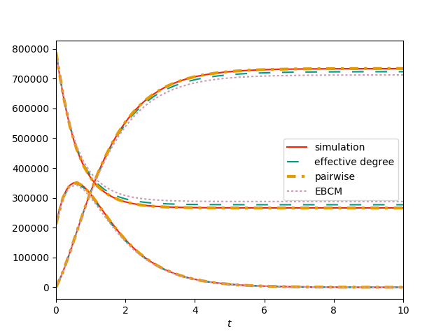

Figure 7.3
-------------

:download:`Downloadable Source Code <fig7p3.py>` 

::

    import networkx as nx
    import EoN
    from collections import defaultdict
    import matplotlib.pyplot as plt
    import scipy
    import random
    
    N=10**6
    tau = 1.
    gamma = 1.
    colors = ['#5AB3E6','#FF2000','#009A80','#E69A00', '#CD9AB3', '#0073B3','#F0E442']
    
    print('setting up --- requires a large network to make clear that effect is real, not noise.')
    deg_seq = []
    for counter in range(N):
        if random.random()< 1./6:
            deg_seq.append(10)
        else:
            deg_seq.append(2)
    
    G = nx.configuration_model(deg_seq)
    
    initial_infecteds = set()
    for u,v in G.edges():
        if G.degree(u) == G.degree(v):
            if random.random()<0.3:
                infectee = random.choice((u,v))
                initial_infecteds.add(infectee)
    
    print('simulating')
    t, S, I, R = EoN.fast_SIR(G, tau, gamma, initial_infecteds = initial_infecteds)
    report_times = scipy.linspace(0,10,101)
    
    S, I, R = EoN.subsample(report_times, t, S, I, R)
    
    plt.plot(report_times, S, color =colors[1], label = 'simulation')
    plt.plot(report_times, I, color = colors[1])
    plt.plot(report_times, R, color = colors[1])
    
    print('doing ODE models')
    t, S, I, R = EoN.SIR_effective_degree_from_graph(G, tau, gamma, initial_infecteds=initial_infecteds, tmax = 10, tcount = 51)
    plt.plot(t,S, color = colors[2], dashes = [6,6], label = 'effective degree')
    plt.plot(t,I, color = colors[2], dashes = [6,6])
    plt.plot(t,R, color = colors[2], dashes = [6,6])
    
    t, S, I, R = EoN.SIR_heterogeneous_pairwise_from_graph(G, tau, gamma, initial_infecteds=initial_infecteds, tmax = 10, tcount = 51)
    plt.plot(t, S, color = colors[3],  dashes = [3,2,1,2], linewidth=3, label = 'pairwise')
    plt.plot(t, I, color = colors[3],  dashes = [3,2,1,2], linewidth=3)
    plt.plot(t, R, color = colors[3],  dashes = [3,2,1,2], linewidth=3)  #, dashes = [6,3,2,3]
    
    
    t, S, I, R = EoN.EBCM_from_graph(G, tau, gamma, initial_infecteds=initial_infecteds, tmax = 10, tcount =51)
    plt.plot(t, S, ':', color = colors[4], label = 'EBCM')
    plt.plot(t, I, ':', color = colors[4])
    plt.plot(t, R, ':', color = colors[4])
    
    plt.axis(xmax=10, xmin=0)
    plt.legend(loc = 'center right')
    plt.xlabel('$t$')
    plt.savefig('fig7p3.png')
