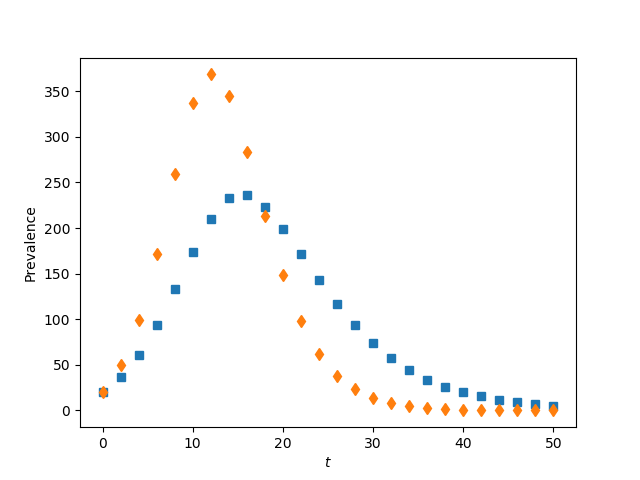
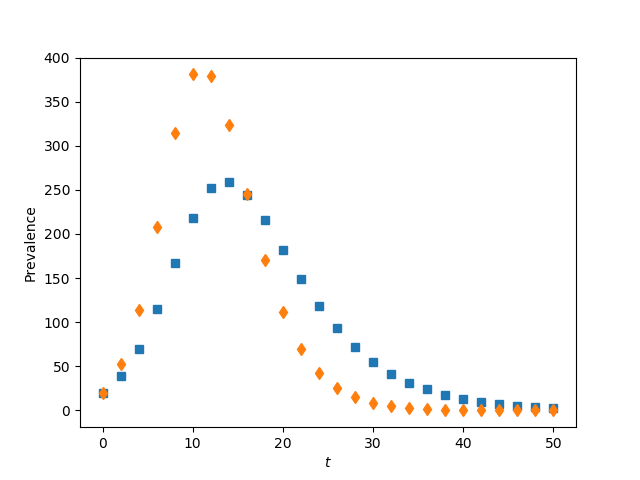

Figure 9.2 (a and b)
---------------------------

:download:`Downloadable Source Code <fig9p2.py>` 

::

    import EoN
    import networkx as nx
    import matplotlib.pyplot as plt
    import random
    import scipy
    
    print("for figure 9.2, we have not yet coded up the system of equations (9.5), so this just gives simulations")
    N = 1000
    n = 10
    gamma = 1./5.5
    tau = 0.545/n
    iterations = 250
    rho = 0.02
    
    ER = nx.fast_gnp_random_graph(N, n/(N-1.)) #erdos-renyi graph
    regular = nx.configuration_model([n]*N) # [n]*N is [n,n, ..., n]
    
    def rec_time_fxn(u, K, gamma):
        duration = 0
        for counter in range(K):
            duration += random.expovariate(K*gamma)
        return duration
        
    def trans_time_fxn(u, v, tau):
        return random.expovariate(tau)
    
    display_ts = scipy.linspace(0, 50, 26)
    for G, filename in ([regular, 'fig9p2a.png'], [ER, 'fig9p2b.png']):
        plt.clf()
        Isum = scipy.zeros(len(display_ts))
        for K, symbol in ([1, 's'], [3, 'd']):    
            for counter in range(iterations):
                t, S, I, R = EoN.fast_nonMarkov_SIR(G, 
                                                    trans_time_fxn=trans_time_fxn,
                                                    trans_time_args=(tau,),
                                                    rec_time_fxn=rec_time_fxn,
                                                    rec_time_args=(K, gamma),
                                                    rho=rho)
                newI = EoN.subsample(display_ts, t, I)
                Isum += newI
            Isum /= iterations
            plt.plot(display_ts, Isum, symbol)
        plt.xlabel('$t$')
        plt.ylabel('Prevalence')
        plt.savefig(filename)
            
                                                    
                