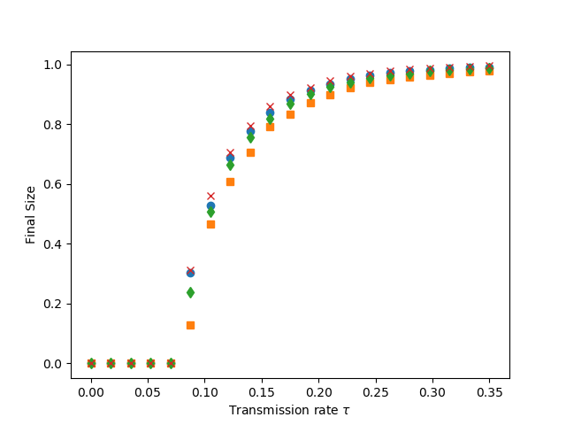
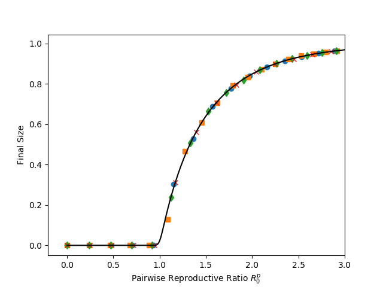

Figure 9.5 (a and b)
---------------------------

:download:`Downloadable Source Code <fig9p5.py>` 

::

    import EoN
    import networkx as nx
    import matplotlib.pyplot as plt
    import random
    import scipy
    
    print("for figure 9.5, we have not coded up the equations to calculate size as a function of tau (fig a), so this just gives simulations.  It does calculate the predicted size as a function of R_0^p. (fig b)")
    
    r'''
    Rather than doing the dynamic simulations, this uses the directed percolation approach
    described in chapter 6.
    '''
    
    N = 100000
    gamma = 1./5.5
    tau = 0.55
    iterations = 1
    rho = 0.001
    kave=15
    
    def rec_time_fxn_gamma(u, alpha, beta):
        return scipy.random.gamma(alpha,beta)
        
    def rec_time_fxn_fixed(u):
        return 1
    
    def rec_time_fxn_exp(u):
        return random.expovariate(1)
        
    def trans_time_fxn(u, v, tau):
        if tau >0:
            return random.expovariate(tau)
        else:
            return float('Inf')
            
        
    def R0first(tau):
        return (kave-1) * (1- 4/(2+tau)**2)
    def R0second(tau):
        return (kave-1) * (1- 1/scipy.sqrt(1+2*tau))
    def R0third(tau):
        return (kave-1)*tau/(tau+1)
    def R0fourth(tau):
        return (kave-1)*(1-scipy.exp(-tau))
    
        
    G = nx.configuration_model([kave]*N)
        
    taus = scipy.linspace(0,0.35,21)
    
    def do_calcs_and_plot(G, trans_time_fxn, rec_time_fxn, trans_time_args, rec_time_args, R0fxn, symbol):
        As = []
        for tau in taus:
            P, A = EoN.estimate_nonMarkov_SIR_prob_size_with_timing(G,trans_time_fxn=trans_time_fxn,
                                                            rec_time_fxn = rec_time_fxn,
                                                            trans_time_args = (tau,),
                                                            rec_time_args=rec_time_args)
            As.append(A)
        plt.figure(1)
        plt.plot(taus, As, symbol)
        plt.figure(2)
        plt.plot( R0fxn(taus), As, symbol)
        
    print("first distribution")
    do_calcs_and_plot(G, trans_time_fxn, rec_time_fxn_gamma, (tau,), (2,0.5), R0first, 'o')
    print("second distribution")
    do_calcs_and_plot(G, trans_time_fxn, rec_time_fxn_gamma, (tau,), (0.5,2), R0second, 's')
    print("fourth distribution")
    do_calcs_and_plot(G, trans_time_fxn, rec_time_fxn_exp, (tau,), (), R0third, 'd')
    print("fifth distribution")
    do_calcs_and_plot(G, trans_time_fxn, rec_time_fxn_fixed, (tau,), (), R0fourth, 'x')
    
    
    plt.figure(1)
    plt.xlabel(r'Transmission rate $\tau$')
    plt.ylabel('Final Size')
    plt.savefig('fig9p5a.png')
    
    R0s = scipy.linspace(0,3,301)
    ps = R0s/(kave-1)
    Apred = [EoN.Attack_rate_discrete({kave:1}, p) for p in ps]
    plt.figure(2)
    plt.plot(R0s, Apred, '-', color = 'k')
    plt.axis(xmax = 3)
    plt.xlabel('Pairwise Reproductive Ratio $R_0^p$')
    plt.ylabel('Final Size')
    plt.savefig('fig9p5b.png')
