# Summary

EoN (EpidemicsOnNetworks) is a pure-python package designed to assist studies of
infectious processes spreading through networks.  It originally rose out of the 
book *Mathematics of Epidemics on Networks* [@EoNbook], and now consists of over 
100 user-functions.


EoN provides a set of tools for

- Susceptible-Infected-Susceptible (SIS) and Susceptible-Infected-Recovered (SIR)
disease
  - Stochastic simulation of disease spread in networkx graphs
    - continuous time Markovian
    - continuous time nonMarkovian
    - discrete time
  - Numerical solution of over 20 differential equation models, including
    - individual and pair-based models
    - pairwise models
    - edge-based compartmental models
- Stochastic simulation of a wide range of Simple and Complex contagions
- Visualization of stochastic simulations

These algorithms are built on the networkx package [@hagberg2008exploring].  
Here we provide brief descriptions with examples of a few of these tools.  
EoN's documentation is maintained at 
https://epidemicsonnetworks.readthedocs.io/en/latest/ 
including numerous examples at 
https://epidemicsonnetworks.readthedocs.io/en/latest/Examples.html.

Because we think of these models as capturing disease spread in a contact network
It is often useful for mathematicians and physicists to formally think of 
individuals as nodes with their potentially infectious partnerships as edges.  
However, for those who come from other backgrounds this abstraction may be a 
little less familiar.  Therefore, we will describe a contact network along which
an infections process spreads as consisting of "individuals" and "partnerships" rather
than "nodes" and "edges".  This has an additional benefit because in the simple 
contagion code, we need to define some other networks whose nodes represent 
possible statuses and whose edges represent transitions that can occur.  Referring
to individuals and partnerships when discussing the process spreading on the
contact network makes it easier to avoid confusion between the different networks.

We start with a description of the tools for studying SIS and SIR disease 
through stochastic simulation and differential equations models.  Then we 
describe the simple and complex contagions, including examples showing how
the simple contagion function can be used to capture a range of standard disease
models.  Finally we demonstrate the visualization software.

## SIR and SIS disease

### Stochastic simulation
The stochastic SIR and SIS simulation tools allow the user
to investigate many standard SIS and SIR dynamics (SEIR/SIRS and other processes
are addressed below):

- Markovian SIS and SIR simulations  (``fast_SIS``, ``Gillespie_SIS``, ``fast_SIR``, and ``Gillespie_SIR``).
- non-Markovian SIS and SIR simulations (``fast_nonMarkovian_SIS`` and ``fast_nonMarkovian_SIR``).
- discrete time SIS and SIR simulations where infections last a single time step 
  (``basic_discrete_SIS``, ``basic_discrete_SIR``, and ``discrete_SIR``).

It is possible for transition rates to depend on intrinsic properties of individuals and
of partnerships.

The continuous-time stochastic simulations have a Gillespie implementation 
[@gillespie1977exact, @doob1945markoff] and an Event-driven
implementation.  Both approaches are efficient.  They have similar speed if the 
dynamics are Markovian (depending on the network and disease parameters either
may be faster than the other), but the event-driven implementation can also handle 
non-Markovian dynamics.  In earlier versions, the event-driven simulations were 
consistently faster than the Gillespie simulations, and thus they are named 
`fast_SIR` and `fast_SIS`.  The Gillespie simulations were sped up using ideas
from [@holme2014model] and [@cota2017optimized].

The algorithms can typically handle an SIR epidemic spreading on 
hundreds of thousands of individuals within a few seconds on a laptop.  The SIS 
versions are slower because the the number of events that can happen is much
larger in an SIS simulation.

#### Examples

To demonstrate these, we begin with SIR simulations on a "Erdős-Rényi" network
having a million individuals (that is, each individual has identical probability
of independently partnering with any other individual in the population).


```python
import networkx as nx
import EoN
import matplotlib.pyplot as plt


N = 10**6  #number of individuals
kave = 5    #expected number of partners
print('generating graph G with {} nodes'.format(N))
G = nx.fast_gnp_random_graph(N, kave/(N-1)) #Erdős-Rényi graph
    
rho = 0.005 #initial fraction infected
tau = 0.3   #transmission rate
gamma = 1.0 #recovery rate

print('doing event-based simulation')
t1, S1, I1, R1 = EoN.fast_SIR(G, tau, gamma, rho=rho)
print('doing Gillespie simulation')
t2, S2, I2, R2 = EoN.Gillespie_SIR(G, tau, gamma, rho=rho)

print('done with simulations, now plotting')
plt.plot(t1, I1, label = 'fast_SIR')
plt.plot(t2, I2, label = 'Gillespie_SIR')
plt.xlabel('$t$')
plt.ylabel('Number infected')
plt.legend()
plt.show()
```

This produces

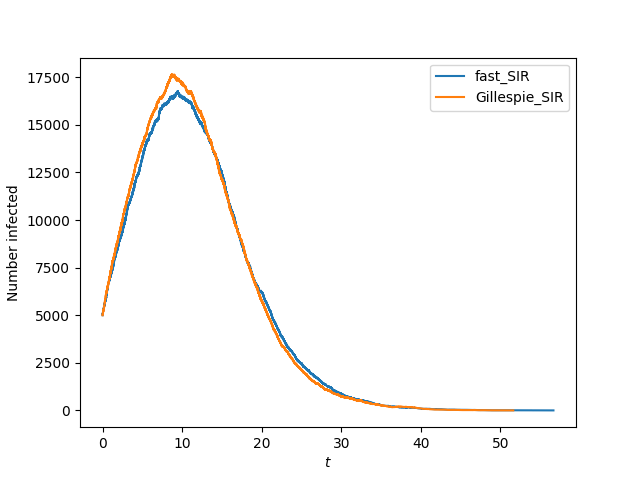    
    
The run-times of ``fast_SIR`` and ``Gillespie_SIR`` are both comparable to the
time taken to generate the million individual network ``G``.  The epidemics 
affect around 28 percent of the population.  The differences in the simulations 
are entirely due to stochastic effects.

We can perform similar simulations with an SIS epidemic.  Because SIS epidemics
take longer to simulate, we use a smaller network and specify the optional 
``tmax`` argument defining the maximum stop time (by default ``tmax=100``).

```python
import networkx as nx
import EoN
import matplotlib.pyplot as plt


N = 10**5   #number of individuals
kave = 5    #expected number of partners
G = nx.fast_gnp_random_graph(N, kave/(N-1)) #Erdős-Rényi graph
    
rho = 0.005 #initial fraction infected
tau = 0.3   #transmission rate
gamma = 1.0 #recovery rate
t1, S1, I1 = EoN.fast_SIS(G, tau, gamma, rho=rho, tmax = 30)
t2, S2, I2 = EoN.Gillespie_SIS(G, tau, gamma, rho=rho, tmax = 30)

plt.plot(t1, I1, label = 'fast_SIS')
plt.plot(t2, I2, label = 'Gillespie_SIS')
plt.xlabel('$t$')
plt.ylabel('Number infected')
plt.legend()
plt.show()
```

This produces

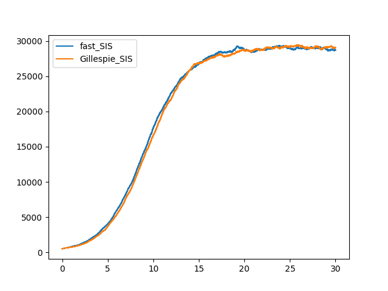

We now consider an SIR disease spreading with non-Markovian dynamics.  We assume
that the infection duration is gamma distributed, but the transmission rate is
constant (yielding an exponential distribution of time to transmission).  
This follows [@vizi2019monotonic].

```python
import networkx as nx
import EoN
import matplotlib.pyplot as plt
import numpy as np

def rec_time_fxn_gamma(u):
    #gamma(shape, scale = 1.0)
    return np.random.gamma(3,0.5)

def trans_time_fxn(u, v, tau):
    if tau >0:
        return np.random.exponential(1./tau)
    else:
        return float('Inf')
N = 10**6  #number of individuals
kave = 5    #expected number of partners
G = nx.fast_gnp_random_graph(N, kave/(N-1)) #Erdős-Rényi graph
tau = 0.3

for cntr in range(10):
    print(cntr)
    t, S, I, R = EoN.fast_nonMarkov_SIR(G, trans_time_fxn = trans_time_fxn,
                        rec_time_fxn = rec_time_fxn_gamma, trans_time_args = (tau,))

    #To reduce file size and make plotting faster, we'll just plot 1000
    #data points.  It's not really needed here, but this demonstrates
    #one of the available tools in EoN.

    subsampled_ts = np.linspace(t[0], t[-1], 1000)
    subI, subR = EoN.subsample(subsampled_ts, t, I, R) 
    plt.plot(subsampled_ts, subI+subR)

plt.xlabel('$t$')
plt.ylabel('Number infected or recovered')
plt.show()                                                            
```    
This produces

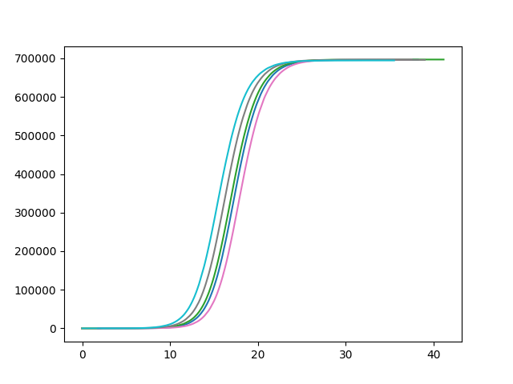

### Differential Equations Models

EoN also provides a set of tools to numerically solve approximately 20 differential equations
models for SIS or SIR disease spread in networks.  The various models use different
amounts of knowledge about the network to make deterministic predictions about
the fraction infected at different times.  These use the Scipy integration tools.
The derivations of the models and explanations of their simplifying assumptions
are described in [@EoNbook].

Depending on the model, we need different information about the network structure.
The algorithms allow us to provide them as inputs to the model.  However, there
is also a version of each model which takes a network as an input 
instead.  This will use the measured properties of the network.

#### Examples

We demonstrate an SIS pairwise model and an SIR edge-based compartmental model.

Our first example uses an SIS homogeneous pairwise model.  This model uses the
average degree of the population and then attempts to track the number of [SI]
and [SS] pairs.   We assume a network with an average degree of 20.  The initial
condition is that a fraction $\rho$ (`rho`) of the population is infected at random.  

```python
import networkx as nx
import EoN
import matplotlib.pyplot as plt

N=10000
gamma = 1
rho = 0.05
kave = 20
tau = 2*gamma/ kave
S0 = (1-rho)*N
I0 = rho*N
SI0 = (1-rho)*kave*rho*N
SS0 = (1-rho)*kave*(1-rho)*N
t, S, I = EoN.SIS_homogeneous_pairwise(S0, I0, SI0, SS0, kave, tau, gamma,
                            tmax=10)
plt.plot(t, S, label = 'S')
plt.plot(t, I, label = 'I')
plt.xlabel('$t$')
plt.ylabel('Predicted numbers')
plt.legend()
plt.show()
```
This produces 

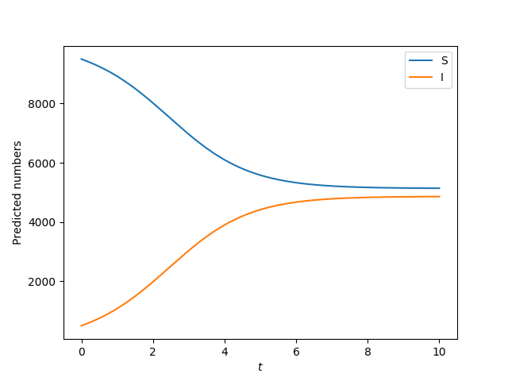

For ease of comparison with simulation, and consistency with existing literature,
the output of the model should be interpreted in terms of an expected number of individuals
in each status, which requires that our values scale with ``N``.  So all of 
the initial conditions have a factor of ``N``.  
If we are interested in proportion,we could arbitrarily set ``N=1``, 
and then our solutions would give us the proportion of the population in each 
status.

Our second example uses an Edge-based compartmental model for an SIR disease.
This model incorporates information about the degree distribution (i.e., how the
number of partners is distributed), but assumes that the partnerships are selected
as randomly as possible given this distribution.  This requires we define the
"generating function" $\psi(x)$ which is equal to the sum 
$\sum_{k=0}^\infty S_k(0) x^k$ where
$S_k(0)$ is the proportion of all individuals in the population who both have $k$
partners and are susceptible at $t=0$.  It also requires the derivative of
$\psi'(x)$ and $\phi_S(0)$, the probability
an edge from a susceptible node connects to another susceptible node at time 0.
By default, it assumes there are no recovered individuals at time $0$.

If the population has a Poisson degree distristribution with mean $kave$ and the 
infection is introduced by randomly infecting a proportion ``rho`` of the population
at time 0, then $\psi(x) = (1-\rho) e^{-rho(1-x)}$, 
$\psi'(x) = (1-\rho)\rho e^{-\rho(1-x)}$
and $\phi_S(0) = 1-\rho$.  So

```python
import networkx as nx
import EoN
import matplotlib.pyplot as plt
import numpy as np

gamma = 1
tau = 1.5
kave = 3
rho = 0.01
phiS0 = 1-rho
def psi(x):
    return (1-rho)* np.exp(-kave*(1-x))
def psiPrime(x):
    return (1-rho)*kave*np.exp(-kave*(1-x))

N=1

t, S, I, R = EoN.EBCM(N, psi, psiPrime, tau, gamma, phiS0, tmax = 10)

plt.plot(t, S, label = 'S')
plt.plot(t, I, label = 'I')
plt.plot(t, R, label = 'R')
plt.xlabel('$t$')
plt.ylabel('Predicted proportions')
plt.legend()
plt.show()
```

This produces 

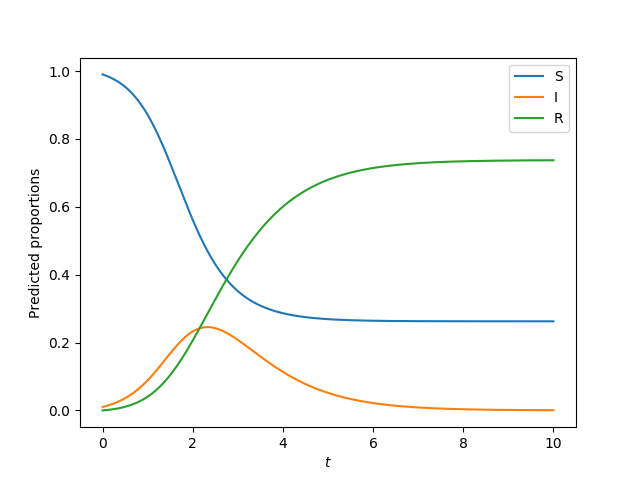.

To be consistent with the other differential equations models, this EBCM implementation
returns the expected *number* in each status, rather than the expected proportion.
Most of the literature on the EBCM approach [@miller:ebcm_overview] focuses on expected proportion.
By setting ``N=1``, we have found the proporitons of the population in each status.


## Simple and Complex Contagions

There are other spreading processes in networks which have received attention.
Many of these fall into one of two types, simple contagions and complex contagions.

In a "simple contagion" an individual ``u`` may be induced to change status by
an interaction with its partner ``v``.  This status change occurs with the same
rate regardless of the statuses of other partners of ``u`` (although, the other
partners may cause ``u`` to change to another status first).  SIS and SIR 
diseases are special cases. of "simple contagions".

In a complex contagion however, we permit the rate at which ``u`` changes from
one status to another to depend on the statuses of others in some more complicated way.
Two infected individuals may cause a susceptible individual to become infected
at some higher rate than would result from them acting independently.  This is
frequently thought to model social contagions where an indivdiual may decide
to believe something if multiple partners believe it [@centola:cascade].  

The simple and complex contagions are currently implemented only in a 
Gillespie setting, and so they require Markovian assumptions.  

### Simple contagions

EoN provides a function ``Gillespie_simple_contagion`` which allows a user to 
specify the rules governing an arbitrary simple contagion.  Because these are based on 
Gillespie approaches, they require Markovian assumptions.

Examples are provided in the documentation, including
- SEIR disease (there is an exposed state before becoming infectious)
- SIRS disease (recovered individuals eventually become susceptible again)
- SIRV disease (individuals may get vaccinated) 
- Competing SIR diseases (there is cross immunity)
- Cooperative SIR diseases (infection with one disease helps spread the other)

The method separates out two distinct ways that transitions occur.  To help demonstrate
consider an "SEIR" epidemic, where individuals begin susceptible, but when they interact
with infectious individuals, they may enter an exposed state.  They remain in that exposed 
state for some period of time before transitioning into the infectious state.  They
remain infectious and eventually transition into the recovered state.

- Sometimes individuals change status without influence from any other individual.
  For example, an infected individual may recover, or an exposed individual may 
  move into the infectious class.  These transitions between statuses can be 
  represented by a directed graph ``H`` where the nodes are not the original 
  individuals of the contact network ``G``, but rather the potential statuses 
  individuals can take.  The edges represent transitions that can occur, and 
  we weight the edges by the rate.  In the SEIR case we would need the graph 
  ``H`` to have edges ``'E'``->``'I'`` and ``'I'``->``'R'``.  The
  edges would be weighted by the transition rates.  Note ``H`` need not have 
  a node ``'S'``.

- Sometimes individuals change status due to the influence of a single other 
  individual.  For example an infected individual may transmit to a susceptible 
  individual.  So an ``('I', 'S')`` pair may become ``('I', 'I')``.
  We can represent these as a directed graph ``J``.  Here the nodes of ``J``
  are pairs (tuples) of statuses, representing potential statuses of individuals 
  in a partnership.  An edge represents a possible partner-induced transition.
  In the SEIR case, there is only a single such transition, represented by the
  edge ``('I', 'S')`` -> ``('I', 'E')`` with a weight representing the transmission
  rate.  No other nodes are required in ``J``.  An edge always represents the
  possibility that a node in the first state can cause the other node to change
  state.  The current version does not allow for both nodes to simultaneously change
  states.
  
#### Examples

We demonstrate this with an SEIR example.  To demonstrate some of the flexibility
we allow some individuals have a higher rate of transitioning from ``'E'`` to ``'I'`` 
and some partnerships have a higher
transmission rate.  This is done by adding weights to the contact network `G`
which scale the rates for those nodes or partners.  The documentation discusses
other ways we can allow for heterogeneity in transition rates.


Note that this process is guaranteed to terminate, so we can set ``tmax`` to 
be infinite.  Processes which may not terminate will require another value.
The default is 100.

```python
import EoN
import networkx as nx
from collections import defaultdict
import matplotlib.pyplot as plt
import random

N = 100000
G = nx.fast_gnp_random_graph(N, 5./(N-1))

#they will vary in the rate of leaving exposed class.
#and edges will vary in transition rate.
#there is no variation in recovery rate.

node_attribute_dict = {node: 0.5+random.random() for node in G.nodes()}
edge_attribute_dict = {edge: 0.5+random.random() for edge in G.edges()}

nx.set_node_attributes(G, values=node_attribute_dict, name='expose2infect_weight')
nx.set_edge_attributes(G, values=edge_attribute_dict, name='transmission_weight')
#
#These individual and partnership attributes will be used to scale
#the transition rates.  When we define `H` and `J`, we provide the name
#of these attributes.

#We show how node and edge attributes in the contact network 'G' can be used
#to scale the transmission rates.  More advanced techniques are shown in
#the documentation

H = nx.DiGraph()
H.add_node('S') #This line is actually unnecessary.
H.add_edge('E', 'I', rate = 0.6, weight_label='expose2infect_weight')
H.add_edge('I', 'R', rate = 0.1)

J = nx.DiGraph()
J.add_edge(('I', 'S'), ('I', 'E'), rate = 0.1, weight_label='transmission_weight')
IC = defaultdict(lambda: 'S')
for node in range(200):
    IC[node] = 'I'

return_statuses = ('S', 'E', 'I', 'R')

t, S, E, I, R = EoN.Gillespie_simple_contagion(G, H, J, IC, return_statuses,
                                        tmax = float('Inf'))

plt.plot(t, S, label = 'Susceptible')
plt.plot(t, E, label = 'Exposed')
plt.plot(t, I, label = 'Infected')
plt.plot(t, R, label = 'Recovered')
plt.xlabel('$t$')
plt.ylabel('Simulated numbers')
plt.legend()
plt.show()
```

This produces 

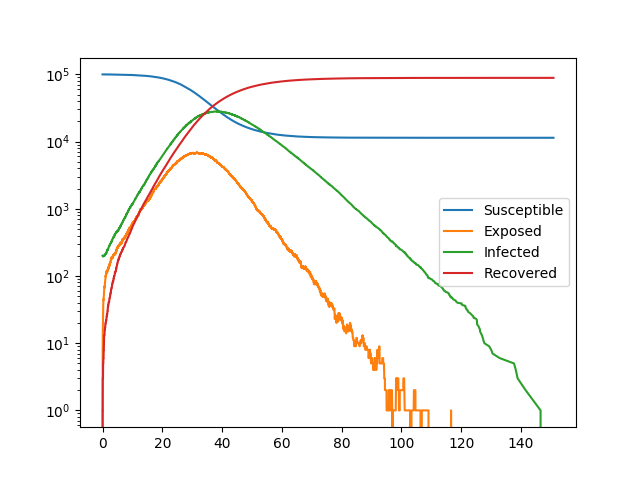
    
Now we show two cooperative SIR diseases.  In isolation, each of these diseases
would be unable to start an epidemic.  However, together, they can, and depending
on stochastic effects, we can see some interesting osillatory behavior.

To the best of  our knowledge, this oscillatory behavior has not been studied
previously.

```python
import EoN
import networkx as nx
from collections import defaultdict
import matplotlib.pyplot as plt

N = 1000000
G = nx.fast_gnp_random_graph(N, 5./(N-1))

#In the below:
#'SS' means an individual susceptible to both diseases
#'SI' means susceptible to disease 1 and infected with disease 2
#'RS' means recovered from disease 1 and susceptible to disease 2.
#etc.

H = nx.DiGraph()  #DiGraph showing possible transitions that don't require an interaction
H.add_node('SS')  #we actually don't need to include the 'SS' node in H.
H.add_edge('SI', 'SR', rate = 1)
H.add_edge('IS', 'RS', rate = 1)
H.add_edge('II', 'IR', rate = 1)
H.add_edge('II', 'RI', rate = 1)
H.add_edge('IR', 'RR', rate = 0.5)
H.add_edge('RI', 'RR', rate = 0.5)

#In the below the edge (('SI', 'SS'), ('SI', 'SI')) means an
#'SI' individual connected to an 'SS' individual can lead to a transition in which
#the 'SS' individual becomes 'SI'.  The rate of this transition is 0.2.
#
#Note that `IR` and `RI` individuals are more infectious than other individuals.
#
J = nx.DiGraph()    #DiGraph showing transitiona that do require an interaction.
J.add_edge(('SI', 'SS'), ('SI', 'SI'), rate = 0.2)
J.add_edge(('SI', 'IS'), ('SI', 'II'), rate = 0.2)
J.add_edge(('SI', 'RS'), ('SI', 'RI'), rate = 0.2)
J.add_edge(('II', 'SS'), ('II', 'SI'), rate = 0.2)
J.add_edge(('II', 'IS'), ('II', 'II'), rate = 0.2)
J.add_edge(('II', 'RS'), ('II', 'RI'), rate = 0.2)
J.add_edge(('RI', 'SS'), ('RI', 'SI'), rate = 1)
J.add_edge(('RI', 'IS'), ('RI', 'II'), rate = 1)
J.add_edge(('RI', 'RS'), ('RI', 'RI'), rate = 1)
J.add_edge(('IS', 'SS'), ('IS', 'IS'), rate = 0.2)
J.add_edge(('IS', 'SI'), ('IS', 'II'), rate = 0.2)
J.add_edge(('IS', 'SR'), ('IS', 'IR'), rate = 0.2)
J.add_edge(('II', 'SS'), ('II', 'IS'), rate = 0.2)
J.add_edge(('II', 'SI'), ('II', 'II'), rate = 0.2)
J.add_edge(('II', 'SR'), ('II', 'IR'), rate = 0.2)
J.add_edge(('IR', 'SS'), ('IR', 'IS'), rate = 1)
J.add_edge(('IR', 'SI'), ('IR', 'II'), rate = 1)
J.add_edge(('IR', 'SR'), ('IR', 'IR'), rate = 1)


return_statuses = ('SS', 'SI', 'SR', 'IS', 'II', 'IR', 'RS', 'RI', 'RR')

initial_size = 650
IC = defaultdict(lambda: 'SS')
for individual in range(initial_size):
    IC[individual] = 'II'

t, SS, SI, SR, IS, II, IR, RS, RI, RR = EoN.Gillespie_simple_contagion(G, H, J, IC, return_statuses,
                                        tmax = float('Inf'))

plt.semilogy(t, IS+II+IR, '-.', label = 'Infected with disease 1')
plt.semilogy(t, SI+II+RI, '-.', label = 'Infected with disease 2')

plt.xlabel('$t$')
plt.ylabel('Number infected')
plt.legend()
plt.show()
```
This produces

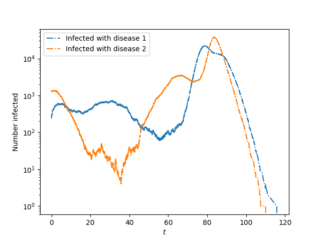

### Complex contagions

Complex contagions are implemented through ``Gillespie_complex_contagion`` which 
allows a user to specify the rules governing a relatively arbitrary complex 
contagion.  The one criteria we note is that there is no memory - an individual 
will change from one status to another based on the current statuses of its 
neighbors, and not based on previous interactions with some neighbors who may 
have since changed status.

In the Gillespie implementation, we need a user-defined function which tells us the rate at
which ``u`` will change status (given knowledge about the current state of the
system) and another user-defined function which tells us what the new status of 
``u`` will be if we decide it is changing status.  We finally need a 
user-defined function that will determine which other nodes have had their 
rate change due to ``u``'s transition.

Once these functions are defined, the Gillespie algorithm is able to perform
the complex contagion simulation.


#### Example

Previous work [@miller:contagion] considered a dynamic version of the Watts 
Threshold Model [@watts:WTM] spreading through clustered and unclustered 
networks.  The Watts Threshold Model is like an SI model, except that nodes 
have a threshold and must have more than some threshold number of infected 
partners before becoming infected.  The dynamic model in [@miller:contagion] assumed
that nodes transmit independently of one another, and a recipient accumulates 
transmissions until reaching a threshold and then switches status.  A given node
``v`` can only transmit once to a node ``u``.  Although is possible to
formulate the model of [@miller:contagion] in a way that is consistent with the assumptions of 
``Gillespie_complex_contagion``, it is more difficult.  

Here we use a simpler model that yields the same final state.  Once a node has
reached its threshold number of infected partners, it transitions at rate 1 to 
the infected state.  The dynamics are different, but it can be proven that the
final states in both models are identical.  The following will produce the
equivalent of Fig. 2a of [@miller:contagion] for our new dynamic model.


```python
import networkx as nx
import EoN
import numpy as np
import matplotlib.pyplot as plt
from collections import defaultdict

def transition_rate(G, node, status, parameters):
    #this function needs to return the rate at which ``node`` changes status
    #
    r = parameters[0]
    if status[node] == 'S' and len([nbr for nbr in G.neighbors(node) if status[nbr] == 'I'])>1:
        return 1
    else:  #status[node] might be 0 or length might be 0 or 1.
        return 0
        
def transition_choice(G, node, status, parameters):
    #this function needs to return the new status of node.  We assume going
    #in that we have already calculated it is changing status.
    #
    #this function could be more elaborate if there were different
    #possible transitions that could happen.  However, for this model,
    #the 'I' nodes aren't changing status, and the 'S' ones are changing to 'I'
    #So if we're in this function, the node must be 'S' and becoming 'I'
    #
    return 'I'
    
def get_influence_set(G, node, status, parameters):
    #this function needs to return any node whose rates might change
    #because ``node`` has just changed status.  That is, which nodes
    #might ``node`` influence?
    #
    #For our models the only nodes a node might affect are the susceptible neighbors.

    return {nbr for nbr in G.neighbors(node) if status[nbr] == 'S'}
    
parameters = (2,)   #this is the threshold.  Note the comma.  It is needed
                    #for python to realize this is a 1-tuple, not just a number.
                    #``parameters`` is sent as a tuple so we need the comma.
                    
N = 600000
deg_dist = [2, 4, 6]*int(N/3)
G = nx.configuration_model(deg_dist)
        
    
for rho in np.linspace(3./80, 7./80, 8):   #8 values from 3/80 to 7/80.
    print(rho)
    IC = defaultdict(lambda: 'S')
    for node in G.nodes():
        if np.random.random()<rho:  #there are faster ways to do this random selection
            IC[node] = 'I'
    
    t, S, I = EoN.Gillespie_complex_contagion(G, transition_rate, transition_choice, 
                            get_influence_set, IC, return_statuses = ('S', 'I'),
                            parameters = parameters)
                            
    plt.plot(t, I)
    
plt.xlabel('$t$')
plt.ylabel('Number infected')
plt.show()
```

We get 

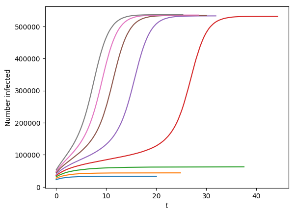, 

which shows that if the initial proportion "infected"
is small enough the final size is comparable to the initial size.  However
once the initial proportion exceeds a threshold, a global cascade occurs and 
infects almost every individual.

If we instead define ``G`` by 

```python
deg_dist = [(0,1), (0,2), (0,3)]*int(N/3)
G = nx.random_clustered_graph(deg_dist)
```

``G`` will be a random clustered network [@miller:random_clustered; @newman:cluster_alg], 
with the same degree distribution as before.  If we use a different range of values 
of ``rho``, such as

```python
for rho in np.linspace(1./80, 5./80, 8):
```

this will produce a figure similar to Fig. 8a of [@miller:contagion].  Note that
the threshold initial size required to trigger a cascade is smaller in this
clustered network.

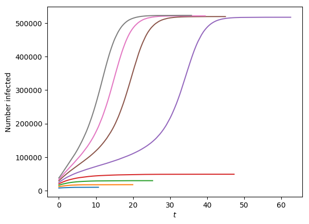

### Visualization & Analysis

By default the simulations return numpy arrays providing the number of individuals
with each state at each time.  However by setting a flag ``return_full_data=True``,
we can know the exact status of each individual at each time, as well as who infected
whom.  There are also methods which use this data to visualize the epidemic at 
a specific time, or to create an animation.  

These algorithms allow for a boolean flag `return_full_data`.  If it is set to `True`,
then the data returned includes the full history of every individual in the network.
In the SIS, SIR or simple contagion cases it also returns information about
which individual induced a transition in some other individual.

There are several visualization tools provided to produce output from the
full data.  These allow us to produce a snapshot of the network at a given time.
By default it also include the time series (e.g., S, I, and R) alongside the
snapshot.  These can be removed, or replaced by other time series, for example
multiple time series in the same axis, or time series generated by one of the
differential equations models.  With appropriate additional packages needed for
matplotlib's animation tools, the software can produce animations as well.

For SIR outbreaks, this produces a transmission tree.  For SIS and simple contagions,
it produces a directed multigraph showing the transmissions that occurred (technically
this may not be a tree).  However for complex contagions, we cannot determine who
is responsible for inducing a transition, so the implementation does not provide
a transmission tree.  The transmission tree is useful for constructing synthetic
phylogenies as in [@moshiri2018favites].


#### Example - a snapshot of dynamics and a transmission tree for SIR disease.

Using the tools provided, it is possible to produce a snapshot of the spreading
process at a given time as well as an animation of the spread.  We consider
SIR disease spreading in the Karate Club network [@zachary1977information].

```python
import networkx as nx
import EoN
import matplotlib.pyplot as plt

G = nx.karate_club_graph()

nx_kwargs = {"with_labels":True}
sim = EoN.Gillespie_SIR(G, 1, 1, return_full_data=True)
sim.display(time = 1, **nx_kwargs)
plt.show()
```
This produces a snapshot at time 1: 

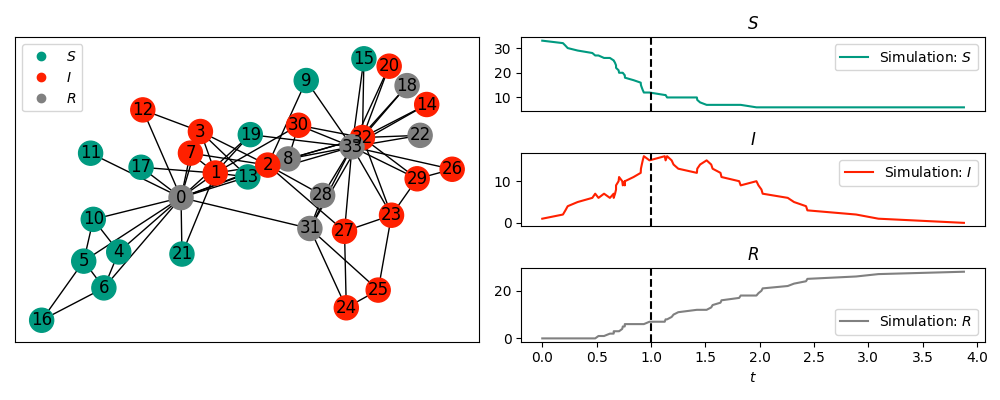.


We can access the transmission tree.
```python
T = sim.transmission_tree()
Tpos = EoN.hierarchy_pos(T)

fig = plt.figure(figsize = (8,5))
ax = fig.add_subplot(111)
nx.draw(T, Tpos, ax=ax, node_size = 200, with_labels=True)
plt.show()
```
This plots the transmission tree:

.

The command ``hierarchy_pos`` is based on [@stackoverflow:29586520]

#### Example - an animation of dynamics for SIR disease with vaccination in a lattice.

We finally consider an SIRV disease, that is an SIR disease with vaccination. 
As the disease spreads susceptible individuals get vaccinated randomly, without 
regard for the status of their neighbors.  

To implement this with EoN, we must use ``Gillespie_simple_contagion``.  

We provide an animation showing the spread.  To make it easier to visualize, 
we use a lattice network.  

    
```python
import networkx as nx
import EoN
import matplotlib.pyplot as plt
from collections import defaultdict

G = nx.grid_2d_graph(100,100) #each node is (u,v) where 0<=u,v<=99
#we'll initially infect those near the middle 
initial_infections = [(u,v) for (u,v) in G if 45<u<55 and 45<v<55]

H = nx.DiGraph()  #the spontaneous transitions
H.add_edge('Sus', 'Vac', rate = 0.01)
H.add_edge('Inf', 'Rec', rate = 1.0)

J = nx.DiGraph()  #the induced transitions
J.add_edge(('Inf', 'Sus'), ('Inf', 'Inf'), rate = 2.0)

IC = defaultdict(lambda:'Sus') #initial condition
for node in initial_infections:
    IC[node] = 'Inf'
    
return_statuses = ['Sus', 'Inf', 'Rec', 'Vac']

color_dict = {'Sus': '#009a80','Inf':'#ff2000', 'Rec':'gray','Vac': '#5AB3E6'}
pos = {node:node for node in G}
tex = False
sim_kwargs = {'color_dict':color_dict, 'pos':pos, 'tex':tex}

sim = EoN.Gillespie_simple_contagion(G, H, J, IC, return_statuses, tmax=30, 
                            return_full_data=True, sim_kwargs=sim_kwargs)

times, D = sim.summary() 
#
#imes is a numpy array of times.  D is a dict, whose keys are the entries in
#return_statuses.  The values are numpy arrays giving the number in that 
#status at the corresponding time.
                      
newD = {'Sus+Vac':D['Sus']+D['Vac'], 'Inf+Rec' : D['Inf'] + D['Rec']}
#
#newD is a new dict giving number not yet infected or the number ever infected
#Let's add this timeseries to the simulation.
#
new_timeseries = (times, newD) 
sim.add_timeseries(new_timeseries, label = 'Simulation', 
                    color_dict={'Sus+Vac':'#E69A00', 'Inf+Rec':'#CD9AB3'})

sim.display(time=6, node_size = 4, ts_plots=[['Inf'], ['Sus+Vac', 'Inf+Rec']])
plt.show()
```
This plots the simulation at time 6.

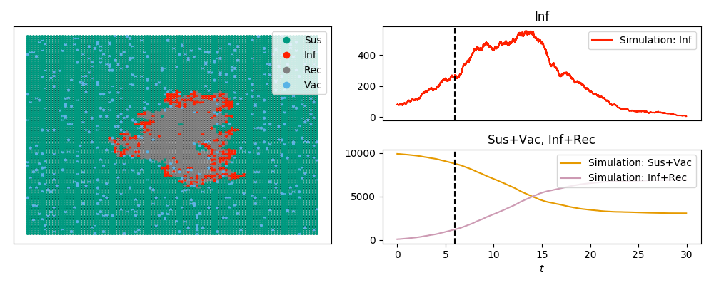

We can also animate it

```python
ani=sim.animate(ts_plots=[['Inf'], ['Sus+Vac', 'Inf+Rec']], node_size = 4)  
ani.save('SIRV_animate.mp4', fps=5, extra_args=['-vcodec', 'libx264'])
```

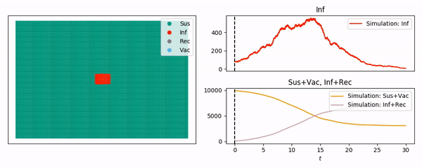

## Discussion

EoN provides a number of tools for studying infectious processes spreading in
contact networks.  The examples given here are intended to demonstrate the
range of EoN, but they represent only a fraction of the possibilities.

Full documentation is available at https://epidemicsonnetworks.readthedocs.io/en/latest/

# Dependencies:

scipy
numpy
networkx
matplotlib

# Funding and Support

This development of EoN has been supported by Global Good and by La Trobe 
University.

# References